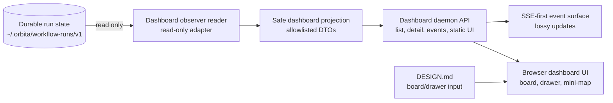

# Orbita Architecture

## Scope

This document is the architecture contract for the Orbita workflow-runner
runtime. It records layer ownership, dependency direction, retired surfaces,
conditional helper/schema zones, matrix v1, and review gates for issue #194.

This contract covers `skills/orbita/**`. It does not define the dashboard visual
design; that remains in `DESIGN.md`.

## Supported Runtime Surface

The canonical workflow-runner command surface is:

- `next`
- `instructions`
- `write-output`
- `continue`
- API `listPointerTransitions` / CLI `list-pointer-transitions`
- API `movePointer` / CLI `move-pointer`

Validation and persistence behavior that supports these commands belongs to the
current runtime architecture. Orchestrator debug notes and worker binding are
bounded `continue` side effects; they do not navigate separately and do not
accept worker output. Obsolete backward-compatibility surfaces do not.

`listPointerTransitions` and `movePointer` are runner API control-plane recovery
surfaces for repositioning only the current baton pointer along already observed
history. Their shell-facing CLI modes are `list-pointer-transitions` and
`move-pointer`. Both require an active run lease. `listPointerTransitions` is a
logical read: it may use the run-state boundary for consistency, but it must not
initialize missing run state, append history, update the run index, or mutate the
baton/current pointer. It is not an unleased public read because it exposes
pointer/history and retained-output recovery metadata. `movePointer` mutates only
baton cursor/status through the existing lease, lock, validation, durable writer,
history, and run-index path. Neither surface rolls back, prunes, rewrites, or cleans
`baton.state`, accepted outputs, artifacts/results, worker bindings, prompt
markers, attempts, or existing history. The first supported slice is limited to
one adjacent observed transition edge from the current pointer/status. Terminal
single-cursor positions, including a completed `done` run, may move backward to
an observed non-terminal step; terminal status must not by itself make pointer
recovery unsupported. Parallel/array cursors remain explicitly unsupported.
Targets with retained accepted output require visible retained-state disclosure
and explicit acknowledgement before mutation.

Retired surfaces:

- `start-run`
- `persist-run-state`
- `workflow-interpreter`
- legacy command aliases
- compatibility wrappers whose only purpose is preserving obsolete paths

Retired surfaces must not remain in supported command paths, exports, docs, or
boundary-check allow lists.

## Custom Workflow Catalog

Custom workflow support is a runtime catalog feature for existing workflow
documents, not a plugin marketplace, visual editor, or autonomous workflow
rewriter. Built-in workflows remain the first-party root. User-provided
workflows are discovered from an Orbita TOML config at `~/.orbita/orbita.toml`
or `ORBITA_CONFIG`.

The supported config shape is:

```toml
[workflow_catalog]

[[workflow_catalog.roots]]
source_id = "team"
path = "~/orbita-workflows"
```

Many configured roots are allowed. They stack after the built-in root in config
order. `source_id` values are stable catalog identities and must not use reserved
ids such as `built-in` or `override`.

Catalog identity is source/path-qualified:

- `workflowRef = <sourceId>:<relativeWorkflowPath>`
- workflow `name` is display and fuzzy-routing metadata
- duplicate names are ambiguous unless an exact `workflowRef` is provided

`workflow-catalog --workflows-root <dir>` remains an isolated compatibility
override. It does not merge with built-ins or configured roots and uses the
reserved `override` source id.

Startup validation is non-bypassable for newly initialized runs. `workflow-runs
create` validates the selected workflow before writing a run-index entry, and
`workflow-runner next` validates before creating a missing lease/index/baton.
Runtime continuation must use the persisted absolute workflow path and must not
rediscover catalog/config roots.

Workflow resource loading is source-aware and bounded to the workflow package
root unless the workflow is built-in and explicitly allowed to use repository
role/template/shared material. Custom workflow names must not widen resource
access by basename.

Workflow-authoring/autotrain is an upstream producer only. Authored packages
become runtime-visible only after human-reviewed promotion into a configured
root or an explicit `--workflows-root` override. Runtime list/resolve/run code
must not import authoring/autotrain internals, scan staging locations, or promote
generated workflows implicitly.

## Layer Ownership

### Entrypoints

Owner: `lib/entrypoints/**`

Entrypoints are transport shells. They parse CLI/API input, coordinate IO with
persistence adapters, acquire or pass through leases where needed, call named
use-case APIs, and format public output.

Pointer recovery entrypoints must keep API and CLI behavior aligned: both
`listPointerTransitions` and `movePointer` require active lease authority, return
only bounded DTOs/errors, and redact lease tokens, token hashes, raw private
paths, raw baton dumps, and full private history text.

Entrypoints may depend on:

- named use-case APIs
- persistence adapters
- DTOs, request/response records, and transport-local schemas

Entrypoints must not depend on:

- `lib/use-cases/runtime/**` internals for stable behavior
- sibling entrypoint shells, including CLI-to-API imports
- entity internals except through approved use-case or DTO boundaries

### Use Cases

Owner: `lib/use-cases/**`

Use cases own application flow over DTOs and plain values. They call entity
owners and IO-free runtime helpers, then return DTOs, projections, or command
results to entrypoints.

Top-level use cases must not import other top-level use cases as a stable
pattern. Shared application policy belongs in a colocated helper or an internal
use-case helper zone only when multiple use cases need the same policy.

`ContinueRun -> ApplyWorkflowOutput` was migrated into an internal workflow-output
helper. Recurrence of top-level use-case-to-use-case imports must fail boundary
checks instead of becoming a stable pattern.

### Entities

Owner: `lib/entities/**`

Entities own workflow-domain invariants and behavior for concepts such as
Workflow, Step, Template, and Baton. Entities are IO-free and owner-isolated.

Entities must not import:

- persistence
- entrypoints
- filesystem/path APIs
- unrelated entity owner internals

`entities/Baton` owns Baton behavior. A durable Baton schema shared by multiple
layers is a file contract, not an entity behavior dependency for persistence.

### Runtime Helpers

Owner: `lib/use-cases/runtime/**` and `lib/runtime/**`

Runtime helpers are deterministic and IO-free. They operate over supplied
values, entities, DTOs, and supplied schema/path facts.

Runtime helpers must not import:

- `node:fs`
- `node:path`
- persistence modules
- workflow-resource loaders

Output validation in runtime helpers consumes loaded schemas and explicit path
facts. Schema loading, realpath probing, symlink checks, and artifact path facts
belong to adapters or file-contract owners.

Pointer transition projection belongs under runner-owned runtime/use-case
internals, not the dashboard. It derives adjacent observed transition edges from
persisted baton plus durable history and must be shared by list and move
validation so inspect-before-mutate output cannot drift from mutation rules.
Retained accepted-output detection must use the same per-step accepted-output
surface in `baton.state[stepId]` that `continue` uses; if extracted, it remains a
small runner-owned helper with tests for current `continue` reuse semantics.

Recoverable blocker helpers under `lib/runtime/**` own public shaping and
redaction of blocker/resolution records. They must receive path facts from the
caller and must not discover workflow-run storage through persistence imports.

Matrix runtime helpers own IO-free matrix request projection, unit output
application, retry/block accounting, and owner join readiness. They may consume
Workflow, Step, Baton, file contracts, loaded output schemas, and supplied path
facts. They must not import persistence, entrypoints, dashboard code, filesystem
APIs, workflow-resource loaders, host sessions, transcripts, private paths, or
lease-token concerns.

### Persistence

Owner: `lib/persistence/**`

Persistence owns filesystem and durable-state integration:

- workflow resource loading
- run-state records
- locks and leases
- durable commits
- run indexes
- path safety facts
- current migration behavior
- schema loading for persisted/file records

Persistence may depend on DTOs, records, and file contracts. Persistence must
not import use cases.

Persistence must not import entity-owned Baton schema after the schema has a
neutral or narrowly colocated file-contract owner.

### File Contracts And Schemas

Owner: a neutral contract zone or a narrow colocated owner, selected by deletion
proof.

Use a separate file-contract/schema zone only when a durable schema is consumed
by multiple layers or when separating it prevents recurring schema/domain
ownership drift. If one narrow owner is enough, colocate the contract with that
owner.

A file-contract/schema zone must own real contracts, not act as a dumping ground
for constants or pass-through wrappers.

Matrix v1 adds two durable file-contract surfaces:

- `workflow-document.json` owns the JSON authoring contract for a first-class
  matrix control step.
- Baton schema owns `state.matrix` durable progress records.

These contracts are shared across validation, runtime, persistence validation,
tests, and documentation. They must stay narrow and must not become a generic
schema dumping ground.

### Boundary Checks

Owner: `.dependency-cruiser.cjs`

`.dependency-cruiser.cjs` is the executable source of truth for Orbita source
dependency direction. This document explains the intent and ownership model;
when a dependency rule is concrete enough to enforce, it belongs in
`.dependency-cruiser.cjs` and CI must run it through
`bun run depcruise:check`.

Boundary checks enforce resolved dependency-direction architecture rules. They
should fail recurrence of forbidden imports while avoiding hard failures for
questions that are still unresolved by the architecture contract.

Checks should cover:

- entrypoints importing runtime internals
- CLI entrypoints importing API entrypoints
- lower layers importing entrypoints
- top-level use cases importing other top-level use cases
- entity families importing other entity families, including nested files
- use-case families importing other use-case families, including nested files
- DTO files importing other DTO files
- top-level use cases importing filesystem/path/persistence
- top-level use cases importing catalog readers
- runtime helpers importing filesystem/path/persistence
- persistence importing use cases
- persistence importing entity-owned Baton schema after migration
- run-state persistence importing startup validation
- runner runtime importing catalog/config discovery
- concrete matrix runtime/helper imports that violate the matrix dependency
  rules below, once those source surfaces exist

## Conditional Zones

`lib/file-contracts/**` and `lib/use-cases/internal/**` are conditional zones.
They are allowed only when they own shared policy or durable contract behavior
that survives the deletion test.

Deletion test:

- If deleting the zone only removes folder structure and no caller complexity
  returns, the zone is folder theater and should be removed.
- If deleting the zone pushes shared policy or contract handling back into
  multiple callers or wrong layers, the zone is earning its boundary.

Default to colocation for a single narrow helper or schema.

## Runtime Flow

A canonical workflow-runner command enters through a CLI or API entrypoint. The
entrypoint parses input, coordinates persistence and lease concerns where
needed, and calls a named use-case API.

The use case performs application flow over DTOs/plain values, entity behavior,
IO-free runtime helpers, and supplied contracts. Persistence loads workflow
resources, schemas, run-state records, leases, and path facts, then passes plain
values or contracts across the boundary.

Entrypoints format current public output and errors. They do not reach into
runtime helper internals to assemble behavior.

Pointer recovery follows the same runtime flow. `listPointerTransitions` checks
the active lease, reads existing persisted run state, builds the shared pointer
transition projection, and returns bounded transition and retained-state metadata
without initializing missing run files, appending history, updating the run index,
or mutating baton/current pointer state. `movePointer` checks the active lease
before and inside the run-state lock, rebuilds the projection while locked,
validates the requested adjacent edge and retained-state acknowledgement, updates only baton
cursor/status, validates persisted state, appends bounded pointer-move history,
and updates run index through the durable writer path.

## Matrix Workflow Control Step

Matrix v1 is a first-class workflow control step for repeated worker units. It
exists to fan out bounded worker work while preserving a simple top-level
workflow cursor.

The authoring shape is JSON only. A matrix step uses `kind: "matrix"` and owns:

- one source, either a static array or an existing runner-supported selector;
- one stable unit id rule;
- optional bounded `max_parallel`;
- optional `max_attempts`, defaulting to one attempt when omitted;
- one worker template with normal role, input, and output contract behavior;
- one normal `next` transition used only after join.

Matrix v1 must reject optional units, fail-fast/cancel-in-flight policy, branch
tables, arbitrary per-item subgraphs, nested matrix, recursive matrix, generated
workflow step ids, and distributed child runs. TOML examples from planning are
discussion-only and are not an implementation format.

### Matrix Cursor And State

While matrix units are active, `baton.cursor` remains exactly the owner matrix
workflow step id. Synthetic unit ids are host request addresses only. They must
not be written into `workflow.steps`, top-level cursor arrays, pointer recovery
targets, or history as independent workflow positions.

Matrix durable progress lives under `baton.state.matrix`, keyed by owner
workflow step id. A matrix owner record owns:

- owner step id;
- source identity or fingerprint;
- aggregate status;
- unit records;
- accepted output references;
- blocker or retry-exhaustion records;
- recomputable join proof.

Unit records own:

- safe unique unit id;
- index or stable order when needed for rendering;
- synthetic request id;
- status;
- attempt count and retry budget;
- bounded safe item context;
- accepted output reference;
- blocker or retry reason.

Source expansion is immutable after durable initialization for the owner/source
fingerprint. Later source re-evaluation must not erase or rewrite in-flight
progress. Restart and `continue --only-instructions` must rerender current unit
requests from durable matrix state, not by reconstructing progress from workflow
source, generated filenames, host memory, worker prose, or artifact directories.

`baton.state.shards` remains the existing review-sharding compatibility surface.
Matrix v1 must not silently reinterpret, rename, migrate, or import
review-sharding policy as the general matrix source of truth. Any unification or
deletion of `state.shards` requires a separate architecture decision.

### Matrix Current Requests

Runtime response projection renders `run_worker` requests for eligible matrix
units only while the owner matrix step is the current cursor. Current requests
must include a synthetic request id, `ownerStepId`, generated runner commands,
and bounded public matrix context. They must not expose raw item payloads by
default, hidden prompts, transcripts, private paths, output paths, session
registries, lifecycle internals, standalone lease/token fields, or token-bearing
internals outside generated commands.

`max_parallel` bounds how many pending/retryable units are current at once when
configured. Accepted, blocked, and retry-exhausted units are not rendered as
normal current work.

`instructions --step-id <synthetic-unit-id>` and `write-output --step-id
<synthetic-unit-id>` are valid only when the synthetic id is present in the
current durable request set for the current owner cursor. Stale owner, stale
unit, wrong owner/unit, and unsafe request ids must fail with the existing
stale-current-request posture.

### Matrix Output And Join

`write-output` remains the only accepted-output path. Unit output is validated
through current request membership, the matrix worker template output schema,
artifact path rules, debug-summary path rules, and retry/block accounting.

Matrix v1 uses runner-owned accepted-output metadata as the unit identity proof:
owner step id, unit id, request id, worker output, artifact/result metadata, and
attempt information. It must not require every worker output schema to add
matrix identity fields.

The owner matrix step transitions only after runner-computed join proof shows
complete required-unit coverage and no required missing, blocked, retry-exhausted,
unsafe, or mismatched unit. Join proof must be recomputable from durable matrix
records and accepted output references. Worker prose, output filenames, hidden
host sessions, raw transcripts, and artifact directory scans are not completion
proof.

The owner aggregate output may expose join proof plus accepted output references
or bounded summaries. Full unit outputs must not be injected into downstream
prompts by default; large or sensitive output should stay behind artifact
references or explicit summaries.

## Recoverable Worker Blockers

`baton.recoverableWorkerBlockers` is runner-owned durable recovery state. It is
keyed by workflow step id and stores only public, bounded blocker and resolution
records. It must not contain transcripts, hidden prompts, lease tokens, raw
worker/approval outputs, private workflow-run paths, or arbitrary local paths.

Lifecycle:

- `write-output` validates the current host output and persists a sanitized
  temporary value in `baton.state[stepId]`.
- `continue` converts a blocked worker/approval output into
  `recoverableWorkerBlockers[stepId]`, removes the blocked output from normal
  baton state, keeps the run `running`, and asks the host to resolve the
  blocker.
- `write-output` for `resolve_worker_blocker` persists a sanitized resolution
  value in `baton.state[stepId]`.
- `continue` moves the sanitized resolution into the existing recoverable
  blocker entry, renders the same step again with resolution context, and clears
  the recoverable blocker only after that step emits normal accepted output.

The final runner statuses remain `needs_host_actions` and `done`; a recoverable
blocker is a host-action pause, not a terminal runner status.

## Dashboard Observer Architecture

The Orbita dashboard is a read-only observation surface over durable
`workflow-runner` run state. It extends the adapter side of Orbita; it does not
join the runner control protocol and does not become another host adapter.

`skills/orbita/DESIGN.md` is the product/design input for the board, card,
drawer, lane, mini-map, and no-control UI rules. This architecture section owns
the backend/UI boundary that makes those design rules safe.

Target shape:

```text
run-state files -> observer reader -> safe projection -> dashboard API/events -> browser UI
```

Intended source zones:

- `lib/dashboard/server/**` owns the local daemon/API shell, static UI serving,
  SSE event stream, file-watch or polling loop, restart rebuild, and degraded
  read isolation.
- `lib/dashboard/projection/**` owns safe dashboard read models, lane
  classification, history excerpt policy, workflow mini-map projection, and
  redaction policy.
- `lib/dashboard/contracts/**` owns browser-visible DTO schemas and examples
  for list, detail, event, degraded diagnostic, artifact summary, cursor chip,
  and mini-map surfaces.
- `lib/dashboard/ui/**` owns browser rendering against those DTOs only.

If these zones become substantial, add `lib/dashboard/CONTEXT.md` in the same
slice to record local ownership and forbidden dependencies. Do not create that
context file for a placeholder-only or documentation-only change.

### Dashboard Bounded Contexts

Dashboard backend is an observer-owned adapter context. It may read durable
workflow-runner state through persistence/run-state adapters or explicit
read-only filesystem adapters, then project the result into dashboard DTOs. It
must isolate per-run read/parse failures as degraded dashboard records and must
not persist those degraded records into workflow state.

Dashboard projection is a read-model context. It owns allowlisted DTOs and
classification policy for `Waiting for user`, `Worker running`, `Blocked`,
`Degraded`, and `Done`. It may expose bounded, redacted history excerpts and
artifact metadata, but it must not expose raw baton, raw history, compiled
instructions, private prompts, token-bearing commands, hidden transcripts,
instruction storage paths, preferred worker agent ids, worker binding flags, or
unnecessary host control-plane metadata.

Dashboard UI is a browser-only inspection context. It consumes safe DTOs from
the daemon API/event surface and follows `DESIGN.md`. It must not read
`~/.orbita` directly, infer runner state from filesystem paths, include
drag/drop movement, or show controls that resemble `next`, `continue`,
`write-output`, retry, repair, or manual lane movement.

### Dashboard Relationships



The dashboard daemon may rebuild projections by rereading durable state after
restart or watcher loss. Event delivery is lossy and observational: SSE/poll
recovery must never create backpressure into workflow execution, hold run
leases, or delay `workflow-runner` control commands.

### Dashboard Dependency Rules

Binding rules for dashboard code:

- `lib/dashboard/**` must not import runner mutation/control entrypoints, CLI
  command builders, lease authority, write-output/continue/next/
  listPointerTransitions/movePointer API handlers, list-pointer-transitions/
  move-pointer CLI modes, or host worker lifecycle code.
- Browser UI code must depend only on dashboard DTO contracts and browser
  platform APIs; it must not import persistence, filesystem helpers,
  workflow-runner API shells, or Node-only modules.
- Projection code may depend on DTO/schema/value helpers and read-only records,
  but must not depend on CLI argument parsing, process environment, locks,
  leases, or mutation use cases.
- Dashboard server code may coordinate read-only IO and response formatting, but
  workflow-domain decisions still belong in existing entities/use cases and
  dashboard-specific display decisions belong in projection.
- Dashboard artifacts, degraded diagnostics, bounded history excerpts, cursor
  chips, and mini-map data are projections. They are not durable workflow state
  and must not be written back into run directories.

Add mechanical boundary checks for these rules when dashboard code is added.
At minimum, tests/checks must prove absence of lease tokens, token-bearing
commands, raw instruction commands, private prompts, hidden transcripts, raw
instruction paths, preferred agent ids, worker binding flags, and unnecessary
host control-plane metadata in browser-visible DTOs.

### Workflow Loop Policies

Workflow loop limits are an opt-in workflow-document contract. A workflow may
declare `loopPolicies` to bound valid semantic cycles such as review -> fix ->
review or approval -> revision -> approval. Workflows without `loopPolicies`
must validate and run with unchanged behavior.

The intended shape is static-graph first:

- the workflow document owns policy definitions;
- validation expands a finite route graph from literal `next`, `match/cases`,
  approval/user routes, and schema-enumerable dynamic `next` expressions;
- validation detects cyclic regions with SCC/self-loop analysis;
- each policy must select exactly one unambiguous detected region;
- runtime counts selected valid internal route events, not full human-described
  cycle rounds;
- `maxIterations` exhausts when the next selected internal event would exceed
  the limit, and runtime routes to the configured `onLimit` target instead of
  the original cycle target;
- baton stores only loop progress counters in a loop-specific namespace, never
  workflow policy definitions.

Loop policies are separate from output.schema retry. Invalid worker or approval
output that is retried by output.schema validation must not increment loop
policy progress. The retry key shape `<stepId>:output.schema` remains reserved
for output.schema attempts; loop policy progress must use a distinct namespace.

Rejected primary models:

- per-transition `cycleId` labels;
- arbitrary named step scopes that create cycles manually;
- runtime history, repeated cursor, backward-jump, or graph traversal heuristics;
- prompt-only loop limits.

Consecutive pass/success early exit is not part of the first loopPolicies
architecture slice. Do not document or implement it as available behavior unless
a later approved architecture contract adds reset, precedence, and success
target semantics.

Parallel/fanout support is conservative for the first slice. A policy that
depends on ambiguous branch-local, cross-branch, non-convergent, or
non-enumerable fanout routing must fail validation instead of being guessed at
runtime.

## Dependency Rules

Allowed:

- `entrypoints -> use-cases`
- `entrypoints -> persistence`
- `use-cases -> entities`
- `use-cases -> runtime helpers`
- `use-cases -> file contracts`
- `runtime helpers -> entities`
- `runtime helpers -> file contracts`
- `persistence -> DTOs/records/file contracts`
- Workflow loop policy validation may depend on workflow contracts, output
  schema target enumerability, route graph expansion, and SCC/self-loop
  detection; it must not depend on baton history or host adapter state.
- Runtime loop policy enforcement may depend on compiled validation metadata,
  the selected valid route event, and baton progress counters; it must not own
  workflow policy definitions.
- Baton schema may define loop progress storage, but workflow schema remains
  the policy source of truth.

Forbidden:

- `entrypoints -> use-cases/runtime/**`
- `entrypoints/cli -> entrypoints/api`
- `use-cases/<top-level> -> use-cases/<top-level>`
- `use-cases/runtime -> node:fs`
- `use-cases/runtime -> node:path`
- `use-cases/runtime -> persistence`
- `lib/runtime -> node:fs`
- `lib/runtime -> node:path`
- `lib/runtime -> persistence`
- top-level use cases -> catalog readers
- runner runtime -> catalog/config discovery
- `persistence -> use-cases`
- run-state persistence -> startup validation
- `persistence -> entities/Baton/schema/**` after schema ownership migration
- matrix runtime/entity helpers -> `node:fs`
- matrix runtime/entity helpers -> `node:path`
- matrix runtime/entity helpers -> persistence
- matrix runtime/entity helpers -> entrypoints
- matrix runtime/entity helpers -> dashboard
- persistence -> matrix runtime/use-case helpers
- general matrix modules -> review-sharding modules as the policy source,
  unless a later migration contract approves an adapter
- supported command paths or exports for retired legacy surfaces
- dashboard code mutating run state, acquiring leases, invoking runner
  navigation/output/pointer-recovery commands, or exposing private runner
  control data through browser-visible DTOs

## Review Gates

Architecture review must verify:

- the changed source still reveals the layer model
- retired surfaces are absent from supported paths
- no new compatibility wrapper is introduced under a different name
- helper/schema zones are colocated unless shared ownership pressure is proven
- docs, checks, and source agree on supported command surface and dependency
  rules
- pointer recovery docs, API exports, CLI modes, tests, and source agree that
  `listPointerTransitions` and `movePointer` require active lease authority,
  preserve baton state, allow terminal single-cursor rollback along observed
  non-terminal backward edges, reject parallel/array cursor scope, require
  retained-output acknowledgement where applicable, and expose only redacted
  bounded metadata
- dashboard changes preserve the read-only observer boundary, safe projection
  layer, SSE/poll recovery behavior, degraded per-run isolation, and
  `DESIGN.md` board/drawer/no-control contract
- dashboard tests or boundary checks prove browser DTOs exclude private
  runner/control fields and dashboard code does not import or call runner
  mutation/control surfaces
- matrix docs, workflow schema, Baton schema, runtime behavior, tests, and
  boundary checks agree on the first-class `kind: "matrix"` contract,
  `state.matrix` ownership, and `state.shards` compatibility
- matrix implementation keeps `baton.cursor` as the owner workflow step id and
  proves synthetic unit ids never become workflow steps, cursor branches, or
  pointer recovery targets
- matrix current request tests prove stale owner, stale unit, wrong owner/unit,
  unsafe unit id, duplicate unit id, retry exhaustion, blocked required unit, and
  missing required coverage do not advance the owner
- matrix DTO/redaction tests prove host requests and downstream owner output do
  not expose raw item payloads, hidden prompts, transcripts, private paths,
  standalone lease/token fields, token-bearing internals outside generated
  commands, or unbounded full unit outputs

Backend review must verify:

- canonical `next`, `instructions`, `write-output`, and `continue` behavior
  remains coherent
- output validation, artifact metadata handling, run-state persistence, leases,
  history, and current migration semantics did not change accidentally
- imports obey the dependency rules above
- custom workflow roots validate before run creation, retain source-qualified
  catalog identity, and do not widen resource access by duplicate workflow name
- matrix source expansion initializes durable state once per owner/source
  fingerprint, restart rerenders eligible units from `state.matrix`, unit output
  updates only the matching durable record, and join proof gates normal `next`
  transition
- existing sequential, approval, fixed parallel, review-shards, output schema,
  lease, artifact/debug-summary, history, worker binding, recoverable blocker,
  and non-matrix workflow behavior remains compatible

QA/reliability review must verify:

- focused workflow-runner checks cover canonical command behavior
- boundary checks fail resolved forbidden imports and retired-surface exposure
- retired legacy names are absent from supported command paths, exports, docs,
  and allow lists
- matrix workflow tests cover valid matrix execution, invalid source shape,
  unsafe and duplicate unit ids for static and runtime-expanded sources, nested
  matrix rejection, unsupported optional/fail-fast/branch/subgraph forms,
  restart rerender, max_parallel, retry/block behavior, complete join, and
  non-matrix regressions

Security and privacy review must verify:

- artifact path handling remains constrained to approved run artifact
  directories
- run-state, lease, history, and output records do not expose new private data
  surfaces while ownership moves
- matrix safe item context is allowlisted or otherwise bounded before storage or
  rendering, and raw item payloads/full unit outputs are not exposed by default

## Non-Goals

- Preserve backward compatibility for obsolete legacy entrypoints, aliases, or
  wrappers.
- Redesign the current public workflow-runner protocol beyond removing obsolete
  surfaces from supported architecture.
- Change host lifecycle semantics for the canonical current runner surface.
- Keep `start-run`, `persist-run-state`, or `workflow-interpreter` as temporary
  exceptions.
- Add broad framework seams where a narrow colocated helper or named use-case
  API is enough.
- Add brittle boundary rules for ownership questions that remain unresolved.
- Use matrix v1 to migrate `state.shards`, redesign fixed parallel/array cursor
  semantics, add optional/fail-fast policy, branch tables, nested per-item
  subgraphs, recursive matrix, distributed child runs, dashboard mutation
  behavior, pointer-recovery matrix mutation, or PR #213 architecture adoption.
